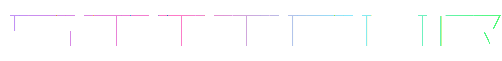

A modern, modular ROM patcher written in Rust supporting multiple patch formats.

## Supported Formats

- **IPS** (International Patching System) - Production Ready (20 tests)
- **BPS** (Beat Patching System) - Production Ready (28 tests)
- **UPS** (Universal Patching System) - Production Ready (26 tests)
- **APS N64** (Nintendo 64 APS Format) - Production Ready (24 tests)
- **APS GBA** (Game Boy Advance APS Format) - Production Ready (24 tests)
- **EBP** (Extended Binary Patch) - Production Ready (26 tests) - IPS + JSON metadata
- **RUP** (Rupture Patches) - Production Ready (27 tests) - Multi-file bidirectional with MD5
- **PPF** (PlayStation Patch Format) - Production Ready (20 tests) - Full PPF1/2/3 support
- **xdelta** (Generic binary diff) - Production Ready (21 tests) - VCDIFF decoder (RFC 3284)
- **BDF** (Binary Diff Format) - Production Ready (22 tests) - BSDIFF40 compatible

## Features

### Implemented
- **Apply patches:** IPS, BPS, UPS, APS N64, APS GBA, EBP, RUP, PPF, xdelta, BDF formats with automatic detection
- **Validation:** Optional CRC32/Adler32 verification via --verify flag
- **Hashing:** CRC32, Adler32, MD5, SHA-1, and SHA-256 computation
- **RetroAchievements:** Console detection + hash verification
- **Console Support:** GB/GBC/GBA, NDS, 3DS, PSX/PS2/PSP, SNES, NES, N64, Genesis, Master System, Game Gear
- **Safety:** Transactional patching with automatic rollback on error
- **Verbosity:** `-v` (verbose) and `-q` (quiet) output controls

## Architecture

The project is organized as a Cargo workspace with 4 crates:

```
stitchr/
├── crates/
│   ├── core/           # Core traits and types
│   ├── formats/        # Patch format implementations
│   ├── features/       # Extended features (validation, hash checking)
│   └── cli/            # Command-line interface
```

### Design Principles

1. **Modular** - Each format and feature is independently implemented
2. **Extensible** - Easy to add new formats via trait implementation
3. **Type-safe** - Leverages Rust's type system for safety
4. **Zero-copy** - Efficient memory usage with slice references
5. **Performance** - SIMD-optimized CRC32 (crc32fast), ~16µs per 1MB ROM
6. **Clean Code** - No file exceeds 200 lines, subdirectory organization

## Building

Requires Rust 1.91+ with 2024 edition support:

```bash
cargo build --release
```

The binary will be at `target/release/stitchr`.

## Usage

### Apply a patch

```bash
# Basic usage (auto-generates output path)
stitchr game.gb patch.ips

# Specify output path
stitchr game.gb patch.ips game-patched.gb

# With checksum verification (slower, safer - validates all CRC32 checksums)
stitchr game.gbc patch.bps game-patched.gbc --verify

# UPS patches
stitchr game.gba patch.ups game-patched.gba

# APS N64 patches (.z64/.n64/.v64)
stitchr game.z64 patch.aps game-patched.z64

# PPF patches (PlayStation)
stitchr game.bin patch.ppf game-patched.bin

# xdelta patches (DS, PS2, etc.)
stitchr game.nds patch.xdelta game-patched.nds
```

The patcher automatically detects the patch format (IPS, BPS, UPS, APS, EBP, RUP, PPF, xdelta, BDF) and applies it.

### EBP patches (IPS + JSON metadata)
```bash
# EBP is IPS-compatible with optional JSON metadata
stitchr game.sfc patch.ebp game-patched.sfc
```

### Verification and checking modes

```bash
# Only verify checksums without applying patch
stitchr game.gbc patch.bps --only verify

# Check ROM against RetroAchievements database
stitchr game.gb --only ra

# Combine multiple operations
stitchr game.gbc patch.bps --only verify ra
```

## Development

### Prerequisites

Install development tools:

```bash
cargo install just cargo-watch cargo-audit cargo-outdated cargo-tarpaulin
```

### Common Tasks

```bash
just              # Show all available commands
just build        # Build in release mode
just test         # Run all tests
just clippy       # Run linter (warnings as errors)
just fmt          # Format code
just bench        # Run benchmarks
just ci           # Run all CI checks
just doc          # Generate and open documentation
```

### Adding a New Format

1. Create a new module in `crates/formats/src/`
2. Implement the `PatchFormat` trait
3. Add format detection in `detect_format()`
4. Add CLI support in `crates/cli/src/commands/apply.rs`
5. Follow test structure from [docs/TEST_TEMPLATE.md](docs/TEST_TEMPLATE.md)
6. Add benchmarks following IPS/BPS patterns

### Testing

```bash
just test                 # Run all tests
just watch-test           # Watch and run tests on changes
cargo test --all-features # Direct cargo command
```

## Documentation

- [CHANGELOG.md](CHANGELOG.md) - Version history and release notes
- [CONTRIBUTING.md](CONTRIBUTING.md) - Contributing guidelines
- [examples/](examples/) - Code examples

## License

MIT OR Apache-2.0

## Performance

Benchmarked on various ROM sizes (v0.4.3):

### Apply Performance

| Format | 1KB | 100KB | 1MB | 16MB |
|--------|-----|-------|-----|------|
| **IPS** | ~93ns | ~2µs | ~27µs | ~700µs |
| **BPS** | ~137ns | ~9µs | ~335µs | ~2.1ms |
| **UPS** | ~1.5µs | ~16µs | ~27µs | ~6.5ms |
| **APS N64** | ~437ns | ~52µs | ~985µs | ~12ms |
| **APS GBA** | ~2.2µs | ~79µs | ~370µs | ~17ms |
| **RUP** | ~4.9µs | ~420µs | ~3.9ms | ~64ms |
| **PPF** | ~550ns | ~2.8µs | ~32µs | ~621µs |
| **BDF** | ~14.6µs | ~1.2ms | ~14.5ms | N/A |
| **xdelta** | N/A | N/A | ~32ms | N/A |

### Validation Performance (constant time)

- **IPS validate:** ~26ns
- **BPS validate:** ~51ns
- **UPS validate:** ~44ns
- **APS N64 validate:** ~93ns
- **APS GBA validate:** ~5.6ns
- **RUP validate:** ~3.6ns
- **PPF validate:** ~375ns
- **BDF validate:** ~20ns
- **xdelta validate:** ~3.7ns

### Metadata Extraction (constant time)

- **BPS metadata:** ~23ns
- **UPS metadata:** ~186ns
- **RUP metadata:** ~297ns

### Binary

- **Size:** 1.4MB (optimized with LTO + strip + minreq)
- **Zero runtime dependencies** (static linking)

Note: BPS/UPS checksums are optional via --verify flag. Without verification, patching is fast. With --verify, all CRC32 checks are performed (patch + source + target). APS N64 includes optional ROM header verification (Cart ID, CRC).

## Project Stats

- **Version:** 0.4.3
- **Test Coverage:** 273 tests
  - Format tests: 238 (20 IPS + 28 BPS + 26 UPS + 24 APS N64 + 24 APS GBA + 26 EBP + 27 RUP + 20 PPF + 21 xdelta + 22 BDF)
  - Integration tests: 14 format helpers + 6 validation + 4 ROM utils
  - RetroAchievements: 11 (7 CLI + 4 features)
- **Code Quality:** All files under 200 lines (modular structure)
- **Build Time:** ~4s (release with LTO)
- **Binary Size:** 1.4MB (with RetroAchievements, optimized with minreq + manual JSON parser)
